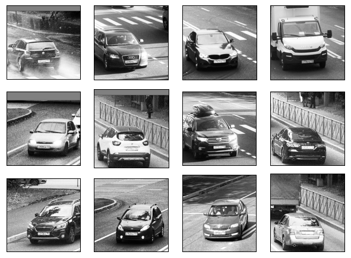
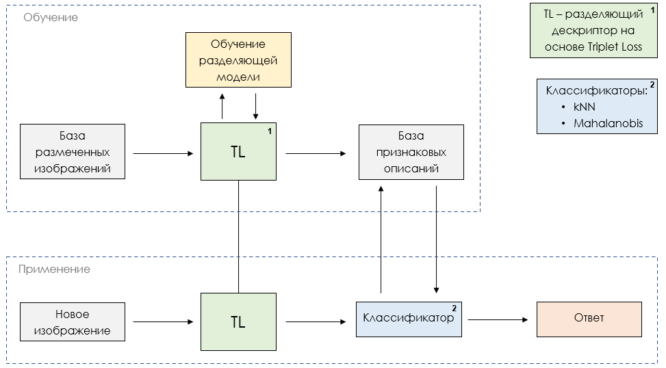
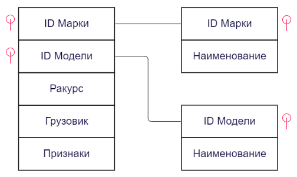
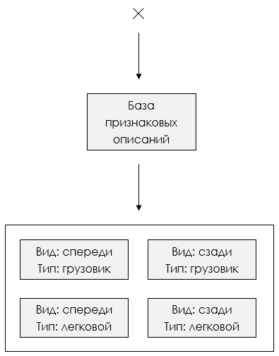

## Junior ML Contest 2022 | ИТМО

В данном репозитории представлены исходные материалы проекта для конкурса
Junior ML Contest. Проект представляет собой результаты моей выпускной
квалификационной работы бакалавра по направлению 01.03.02 "Прикладная математика
и информатика" Санкт-Петербургского Государственного Экономического Университета
(СПбГЭУ).

Тема: "Решение задачи классификации методом векторизации Triplet Loss"

Содержание: Реализация системы распознавания марок и моделей автомобилей на
изображениях в рамках задачи от компании ООО "СОФТ ИМПУЛЬС"

### Постановка задачи

**Компания-заказчик**: ООО "СОФТ ИМПУЛЬС"

**Задача**: Необходимо построить модель для решения задачи классификации автомобилей
по маркам и моделям.

**Данные**: Изображения автомобилей различных марок, моделей, годов и ракурсов:

Данные предоставляются заказчиком.

**Предполагаемое решение**: Система, позволяющая улучшить качество классификации
марки и модели автомобиля относительно стандартных классификационных подходов.
Ключевая особенность - система должна уметь определять новые объекты как
отдельные классы.

**Актуальность задачи**: Заказчик хочет решить задачу нахождения угнанных автомобилей на основе
инструментов видеоаналитики.

### Цели и задачи работы 

Цель - реализация классификатора на основе разделяющего подхода.

Задачи:

1. Реализация модели векторизации и кластеризации исходных данных;
2. Оценка разделяющей способности модели кластеризации;
3. Визуализация кластеров признаков;
4. Реализация метрических классификаторов в новом признаковом пространстве;
5. Оценка возможности обнаружения новых объектов.

### Результаты работы

Схема работы результирующей системы:

Таким образом в процессе обучения из базы размеченных изображений формируется
база признаковых описаний, над которой строятся метрические классификаторы, 
непосредственно распознающие изображение на этапе использования модели.

Исходная выборка данных сильно не сбалансирована по классам. Таким образом была
проведена предварительная подготовка данных. Результаты представлены в ноутбуке
[1. Dataset analysis](https://github.com/vederko-p/Junior-ML-Contest/blob/master/1.%20Dataset%20analysis.ipynb).

На основе обработанной выборки были построены и обучены Triplet Loss модели по
маркам и моделям. Результаты представлены в ноутбуках:
* [2.1. Triplet Loss Model. Marks](https://github.com/vederko-p/Junior-ML-Contest/blob/master/2.1.%20Triplet%20Loss%20Model.%20Marks.ipynb)
* [2.2. Triplet Loss Model. Models](https://github.com/vederko-p/Junior-ML-Contest/blob/master/2.2.%20Triplet%20Loss%20Model.%20Models.ipynb)

На основе метода главных компонент были представлены результирующие признаковые
описания изображений в трехмерном пространстве. Соответствующие результаты
представлены в ноутбуке [3. Diffusion Map](https://github.com/vederko-p/Junior-ML-Contest/blob/master/3.%20Diffusion%20Map.ipynb).

Для построения базы признаковых описаний использовалась следующая структура
данных:

Метрические модели классификации включают в себя логику подключения к базе
признаковых описаний для получения необходимой информации для обучения.
Результаты реализации метрических моделей классификации представлены в ноутбуке
[4. Metric models](https://github.com/vederko-p/Junior-ML-Contest/blob/master/4.%20Metric%20models.ipynb).

Одной из модификаций системы может быть условное разделение базы признаковых
описаний на четыре непересекающихся области:

Это разумно ввиду того, что изображения визуально отличимы по данным классам,
что проявляется в уровне качества классификации соответствующих моделей.
Результаты приведены в соответсвующих ноутбуках:
* [5.1. View classifier](https://github.com/vederko-p/Junior-ML-Contest/blob/master/5.1.%20View%20classifier.ipynb)
* [5.2. Truck classifier](https://github.com/vederko-p/Junior-ML-Contest/blob/master/5.2.%20Truck%20classifier.ipynb)

В итоге это может улучшить точность распознавания ввиду некоторой разгрузки
метрических классификаторов, что демонстрируется в соответствующем ноутбуке, в
котором представлены результаты сравнения различных метрических классификаторов
[6. Models results analysis](https://github.com/vederko-p/Junior-ML-Contest/blob/master/6.%20Models%20results%20analysis.ipynb).

Оценка возможности распознавания новых объектов на основе фиксации расстояния до
ближайшего кластера представлена в ноутбуке [7. New objects detection](https://github.com/vederko-p/Junior-ML-Contest/blob/master/7.%20New%20objects%20detection.ipynb).
Таким образом для решения данной задачи могут быть применены методы
кластеризации, основанные на плотностном понятии кластера - методы DBSCAN и
OPTICS.

### Дальнейшее развитие работы

У представленного решения есть большое количество потенциальных улучшений
качество его работы. Ими могут быть:

* Усложнение архитектуры нейронной сети дескриптора. Здесь могут быть применены
трансформеры;
* Помимо метрических классификаторов нагрузку также можно снять и с моделей 
дескрипторов, разделив модели, например, по ракурсам;
* Разгрузка моделей, предложенная в предыдущем варианте, может позволить 
уменьшить число признаков, чем можно воспользоваться следующим образом. Можно
использовать две модели, одну на основе целых изображений, вторую на основе
кропнутых изображений. Результирующим набором признаков будет конкатенация
результатов двух моделей;
* В ближайшем будущем работу планируется довести до научной публикации.
